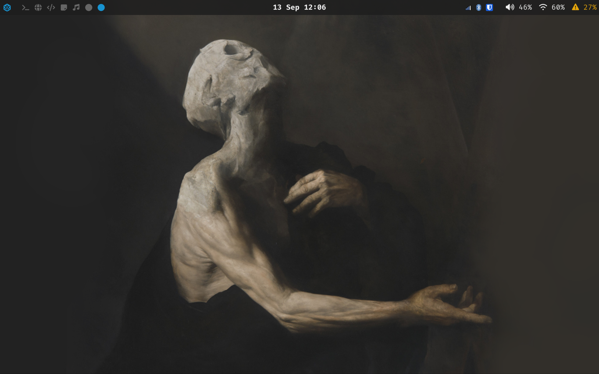

# Dotfiles

My configuration files and the Ansible setup for Arch Workstation.



## Layout

```
ansible/     site.yml + roles
config/      stow package
scripts/     helper scripts
```

## Installation

```bash
git clone https://github.com/spiperac/dotfiles.git
cd dotfiles
./setup.sh
```

Log out and back in for the login shell and group changes.

Single role:

```bash
cd ansible && ansible-playbook site.yml -K --tags pentest
```
