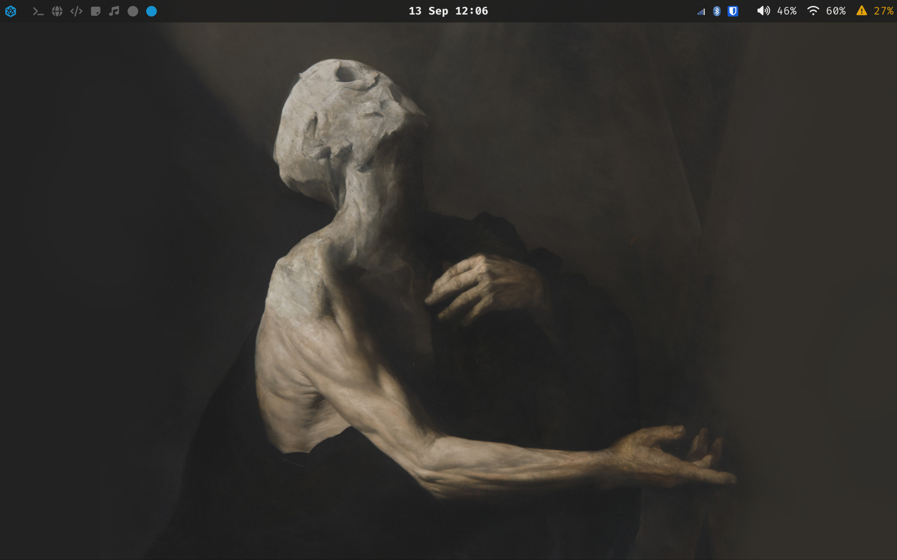

# Dotfiles

My configuration files and the Ansible setup for my workstations (Arch Linux, Gentoo, Debian).



## Layout

```
ansible/     site.yml + roles
config/      stow package
scripts/     helper scripts
```

## Installation

Gentoo and Debian use doas with a nopass rule. On a fresh Debian, as root:

```bash
apt install opendoas
echo "permit nopass <user> as root" > /etc/doas.conf
chmod 0400 /etc/doas.conf
```

Then, as your user:

```bash
git clone https://github.com/spiperac/dotfiles.git
cd dotfiles
./setup.sh
```

`setup.sh` runs the play for the inventory entry matching this machine's
hostname (`DOTFILES_HOST=x1nano ./setup.sh` to override). Log out and back in
for the login shell and group changes.

## Machines

Each machine has one line in `ansible/inventory.ini` and its choices in
`ansible/host_vars/<name>.yml`:

```yaml
desktop_sessions: [sway]   # sway, gnome, or both
```

## Roles

```
base       system, package manager, CLI tools, shell, terminals, fonts
desktop    common desktop bits + sway and/or gnome, picked per machine
apps       applications, networking (VPN, tailscale)
media      players, readers, NAS
dev        languages, DevOps, containers, virtualization
security   pentest and exploit dev tools
iam        SSH and NAS identities from pass
```

Single role or part:

```bash
./setup.sh --tags security
./setup.sh --tags sway
```
